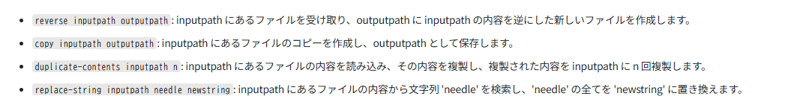

# File Manipulator Program
Recursionのバックエンドプロジェクト１「File Manipulator Program」のために作成したUbuntu環境＋ソースコード＋テストコードである。  
ソースコードは`python_practice/`内に存在する。  
  
## 使用方法
```bash
docker compose up -d
```  
上記にて環境を立ち上げる  
  
肝心のプログラムは下記画像に則って作成した。  
  
  
基本的には`python_practice/`ディレクトリでの実行を想定しているが、各ファイルパスに問題がなければ特に問題はない。
```python
python3 file_manipulator_program.py <command> args...
```  
  
## テスト
`python_practice/test_file_manipulator_program.py`にpytestによるテストコードを作成してある。  
下記コマンドにて動作する。  
```python
pytest test_file_manipulator_program.py
```
